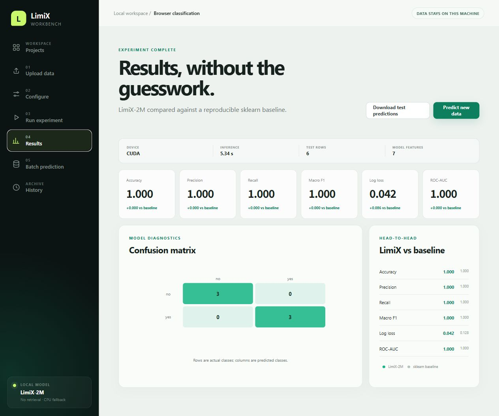
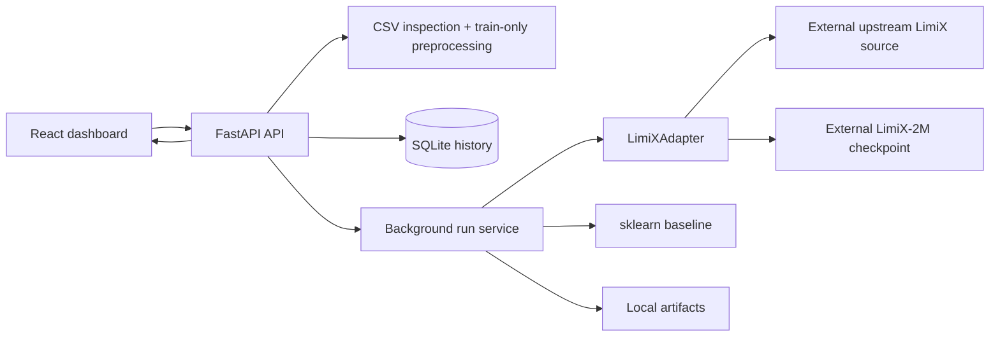

# LimiX Workbench

Local-first AI workbench for tabular classification and regression with
**LimiX-2M**. Upload a CSV, inspect data quality, configure a leakage-safe split,
run real LimiX inference, compare it with sklearn, persist the experiment, and
download predictions from one browser application.



## What it provides

- React + TypeScript dashboard; no Streamlit, Gradio, or notebook UI.
- CSV encoding, structure, duplicate, missing-value, type, size, row, and feature checks.
- Automatic or explicit classification/regression selection.
- Stratified classification splits where valid; preprocessing fits training rows only.
- Cached LimiX-2M no-retrieval adapters for classification and regression.
- CUDA selection with a real CPU path and automatic CUDA OOM fallback.
- Accuracy, precision, recall, Macro F1, conditional ROC-AUC/log loss, confusion matrix.
- RMSE, MAE, R², actual/predicted points, and residual data.
- sklearn baseline comparison and inference timing.
- SQLite project/run history and local artifacts that survive restarts.
- Feature-only batch CSV prediction with class probabilities when available.
- Consistent API errors, asynchronous run polling, working downloads, tests, and CI.

## Architecture



The repository never vendors upstream LimiX, model weights, uploaded data,
SQLite databases, or generated artifacts. Runtime locations come from `.env`.

## Windows installation

Prerequisites: Windows, Git, Node.js 22+, Conda, the upstream LimiX source tree,
and a locally obtained LimiX-2M checkpoint. Start from the upstream LimiX
environment so its PyTorch and model dependencies remain authoritative.

```powershell
git clone <your-limix-workbench-repository>
cd limix-workbench
conda env create -f C:\path\to\LimiX\environment.yml -n limix  # if not already created
powershell -ExecutionPolicy Bypass -File .\scripts\setup.ps1
```

Edit `.env` and set `LIMIX_SOURCE_DIR`, `LIMIX_MODEL_PATH`, and the two
no-retrieval config paths. The model filename must be `LimiX-2M.ckpt`; do not use
LimiX-16M or retrieval configs.

```powershell
powershell -ExecutionPolicy Bypass -File .\scripts\run.ps1
```

Open **http://127.0.0.1:8000**. The script builds the React application when
needed and FastAPI serves the production assets and API on that single address.

For development, after setup and `.env` configuration:

```powershell
powershell -ExecutionPolicy Bypass -File .\scripts\run-dev.ps1
```

The Vite UI runs at `http://127.0.0.1:5173` and proxies `/api` to port 8000.

## CUDA and CPU

`LIMIX_DEVICE=auto` prefers CUDA. If CUDA is unavailable it selects CPU; if a CUDA
run exhausts VRAM and `LIMIX_CPU_FALLBACK=true`, the adapter clears the CUDA cache
and retries on CPU. Set `LIMIX_DEVICE=cpu` to force CPU. Device choice and LimiX
inference time are saved with each run.

The verified local environment used PyTorch `2.7.1+cu128`, a Quadro P620 with
4 GB VRAM, and LimiX-2M. Both classification and regression were also executed on
CPU—not simulated.

## Example workflow

1. Upload `examples/classification.csv`.
2. Create a project and select `target` as the target column.
3. Choose classification, a 20% test split, and seed 42.
4. Run the experiment and wait for the status to reach `completed`.
5. Review LimiX/baseline metrics and download held-out predictions.
6. Upload `examples/classification-batch.csv` in Batch prediction and download the result.

`examples/regression.csv` covers the equivalent regression flow.

For a larger realistic test, use `examples/uci-adult-income-5000.csv` with
`income` as the classification target, then use
`examples/uci-adult-income-batch-250.csv` for batch prediction. See the adjacent
`uci-adult-README.md` for source and license attribution.

## API and tests

Interactive OpenAPI documentation is at `http://127.0.0.1:8000/docs`; the endpoint
summary is in [docs/API.md](docs/API.md).

```powershell
python -m ruff check .
python -m pytest
cd frontend
npm ci
npm run lint
npm run typecheck
npm run build
```

Real local adapter smoke test:

```powershell
python .\scripts\smoke_limix.py `
  --source C:\path\to\LimiX `
  --model C:\path\to\LimiX\cache\LimiX-2M.ckpt `
  --device auto
```

CI deliberately skips only that real smoke test because the separately licensed
checkpoint is not committed. Ordinary code failures are never converted to skips.

## Repository layout

```text
backend/app/{api,core,models,schemas,services}
backend/tests
frontend/src/{components,pages,services}
scripts
examples
docs
artifacts              # ignored runtime content; .gitkeep only
```

## Troubleshooting

- **Model/config missing:** verify every path in `.env`; use forward slashes or valid escaped Windows paths.
- **CUDA unavailable:** set `LIMIX_DEVICE=cpu`, or repair the CUDA-enabled PyTorch environment.
- **CUDA out of memory:** keep fallback enabled, reduce rows/features, or force CPU.
- **Batch columns rejected:** upload exactly the original selected feature columns, without the target.
- **Run failed:** the UI shows a safe message; inspect the backend console/log for the traceback.
- **Port 8000 busy:** stop the other process before running the one-address production mode.

## Known limits

- Default limits: 25 MB, 10,000 rows, 100 source features, 500 encoded features, 20 classes.
- One process performs local background jobs; this is not a distributed job server.
- No retrieval, LimiX training, fine-tuning, missing-value imputation, or LimiX-16M.
- Uploaded feature missing values are imputed; target missing values are rejected.
- The API binds to loopback and has no multi-user authentication.

## License, model terms, and citation

Workbench code is licensed under [Apache License 2.0](LICENSE). Upstream LimiX
source is also Apache-2.0, but **LimiX model weights use a separate Model License**.
This repository does not redistribute weights; obtain permission appropriate to
your use from the [LimiX project](https://github.com/limix-ldm/LimiX). See
[NOTICE](NOTICE) for attribution.

```bibtex
@article{zhang2025limix,
  title={LimiX: Unleashing Structured-Data Modeling Capability for Generalist Intelligence},
  author={Zhang, Xingxuan and Ren, Gang and Yu, Han and others},
  journal={arXiv preprint arXiv:2509.03505},
  year={2025}
}
```

The LimiX Workbench authors thank the upstream LimiX team for publishing the
model implementation, technical report, and inference interfaces.
